# Polyglot Codebase Knowledge Graph

> Generated offline by **readmenator**. Supports C, C++, Python, Go, Rust, JS/TS, Java, C#, Shell, PHP, Dart, GDScript, Nim, ASM, Ruby, Swift, Kotlin, Scala, Lua, Elixir.
> No LLMs. No tokens. Pure static analysis. See more [here](https://github.com/grisuno/ReadMenator)

**Total Files Parsed:** 4 | **Total Symbols Extracted:** 78 | **Total Imports:** 37

<!-- ranking_model: v1.0 | weights: {ppr:0.45,auth:0.2,test:0.15,doc:0.1,fresh:0.1} | alpha:0.85 | commit:e63a2e6 | date:2026-07-18 -->


## Table of Contents

1. [Statistics Dashboard](#statistics-dashboard)
2. [Architectural Layers](#architectural-layers)
3. [Ranked Context](#ranked-context)
4. [God Nodes](#god-nodes)
5. [Community Analysis](#community-analysis)
6. [Suggested Questions](#suggested-questions)
7. [Hotspot Analysis](#hotspot-analysis)
8. [Change Impact Analysis](#change-impact-analysis)
9. [Suggested Linting Rules](#suggested-linting-rules)
10. [Orphans](#orphans)
11. [Query Recipes](#query-recipes)
12. [Structural Knowledge Map](#structural-knowledge-map)
13. [Code Property Graph](#code-property-graph)
14. [Architecture Reference](#architecture-reference)
    - [C (3 files)](#c-3-files)
    - [H (1 files)](#h-1-files)

---

## Statistics Dashboard

| Metric | Value |
|--------|-------|
| Total Files | 4 |
| Total Symbols | 78 |
| Total Imports | 37 |
| Call Edges | 0 |
| Inheritance Edges | 0 |
| Languages | 2 |
| Avg Symbols/File | 19.5 |
| Avg Imports/File | 9.2 |

### Top Files by Import Count (Fan-Out)

| File | Imports | Symbols | Language |
|------|---------|---------|----------|
| `pedit_primitive.c` | 18 | 54 | c |
| `packet_edit_meme.c` | 11 | 9 | c |
| `test_cve.c` | 6 | 12 | c |
| `pedit_primitive.h` | 2 | 3 | h |

### Top Files by Imported-By Count (Fan-In)

| File | Imported By | Symbols | Language |
|------|-------------|---------|----------|
| `pedit_primitive.h` | 3 | 3 | h |

---

## Architectural Layers

Auto-detected from path patterns, naming conventions, and imported frameworks.

| Layer | Files |
|-------|-------|
| infrastructure | 3 |
| testing | 1 |

### infrastructure

- `packet_edit_meme.c` (c, 9 symbols)
- `pedit_primitive.c` (c, 54 symbols)
- `pedit_primitive.h` (h, 3 symbols)

### testing

- `test_cve.c` (c, 12 symbols)

---

## Ranked Context

Files ranked by composite score for the current query context. The ranking combines Personalized PageRank (query relevance), global authority, test coverage, documentation coverage, and code freshness. Model: v1.0.

| Rank | File | Composite | PPR | Authority | Test | Doc |
|------|------|-----------|-----|-----------|------|-----|
| 1 | `pedit_primitive.h` | 0.3523 | 0.5420 | 0.5420 | 0.00 | 0.00 |
| 2 | `packet_edit_meme.c` | 0.1215 | 0.1527 | 0.1527 | 0.00 | 0.22 |
| 3 | `pedit_primitive.c` | 0.1159 | 0.1527 | 0.1527 | 0.00 | 0.17 |
| 4 | `test_cve.c` | 0.0992 | 0.1527 | 0.1527 | 0.00 | 0.00 |

---

## God Nodes

Most architecturally central files ranked by combined import/export degree and symbol richness.

| File | Score | Connections | PageRank |
|------|-------|-------------|----------|
| `pedit_primitive.c` | 7.4 | | 0.1527 |
| `pedit_primitive.h` | 6.3 | | 0.5420 |
| `test_cve.c` | 3.2 | | 0.1527 |
| `packet_edit_meme.c` | 2.9 | | 0.1527 |

---

## Community Analysis

Files grouped by import-based community detection. Cohesion measures how tightly connected each community is internally.

### root (Cohesion: 1.00)

**4 files** in this community:

- `packet_edit_meme.c` (c, 9 symbols)
- `pedit_primitive.c` (c, 54 symbols)
- `pedit_primitive.h` (h, 3 symbols)
- `test_cve.c` (c, 12 symbols)

---

## Suggested Questions

Auto-generated exploration prompts based on graph structure:

- What does pedit_primitive.c depend on, and what depends on it? (1 connections)
- What does pedit_primitive.h depend on, and what depends on it? (3 connections)
- What does test_cve.c depend on, and what depends on it? (1 connections)
- How are the 4 files in 'root' related to each other?
- What is meta_value in pedit_primitive.c and how is it used?

---

## Hotspot Analysis

Files ranked by combined complexity (symbol count) and centrality (connection count). High-scoring files are architecturally critical and may need refactoring attention.

| File | Complexity | Centrality | Combined | Symbols | Connections |
|------|-----------|------------|----------|---------|-------------|
| `pedit_primitive.h` | 0.056 | 0.278 | 0.189 | 3 | 5 |
| `packet_edit_meme.c` | 0.167 | 0.611 | 0.433 | 9 | 11 |
| `pedit_primitive.c` | 1.000 | 1.000 | 1.000 | 54 | 18 |
| `test_cve.c` | 0.222 | 0.333 | 0.289 | 12 | 6 |

---

## Change Impact Analysis

Files sorted by how many other files would be affected if they changed. High-impact files should be changed with caution.

| File | Direct Dependents | Transitive Dependents | Total Impact |
|------|------------------|----------------------|--------------|
| `packet_edit_meme.c` | 0 | 0 | 0 |
| `pedit_primitive.c` | 0 | 0 | 0 |
| `pedit_primitive.h` | 0 | 0 | 0 |
| `test_cve.c` | 0 | 0 | 0 |

---

## Suggested Linting Rules

Automatically suggested linting and security rules based on patterns detected in the codebase. These can be exported as Semgrep rules using the `--export-rules` flag.

| Rule ID | Severity | Description | Language | Matches |
|---------|----------|-------------|----------|---------|
| `RM001` | info | Large number of functions in c: 30 total | c | 30 |

---

## Orphans

Files with no documentation or low connectivity. These are candidates for documentation investment or cleanup.

- `pedit_primitive.h` (3 symbols, no doc)
- `test_cve.c` (12 symbols, no doc)

---

## Query Recipes

Example queries you can run against this knowledge base using the ranking engine:

```
# Find files most relevant to a concept
readmenator query "Where is the import resolver implemented?"

# Rank files by relevance to a topic
readmenator query "How does documentation generation work?"

# Explain why a file ranks highly
readmenator query "explain readmenator/_documentation.py"

# Trace dependency paths with ranked context
readmenator query "path from CLI to exporter"
```

The ranking model uses the following signals:

- **Personalized PageRank** (45% weight): query-specific relevance via seed propagation
- **Global Authority** (20% weight): structural importance via standard PageRank
- **Test Coverage** (15% weight): fraction of symbols referenced in test files
- **Doc Coverage** (10% weight): presence of docstrings and file-level docs
- **Freshness** (10% weight): recent modification activity

Results include score decomposition and justification paths for each ranked item.

---

## Structural Knowledge Map

```mermaid
graph TD
    classDef mod fill:#1e1e1e,stroke:#ff6666,stroke-width:2px,color:#fff;
    classDef cls fill:#2d2d2d,stroke:#4ec9b0,stroke-width:2px,color:#fff;
    classDef fn fill:#333,stroke:#dcdcaa,stroke-width:1px,color:#dcdcaa;
    classDef ext fill:#111,stroke:#666,stroke-dasharray:5 5,color:#aaa;
    subgraph community_0 ["root"]
    pedit_primitive_c["pedit_primitive.c (c)"]
    class pedit_primitive_c mod;
    pedit_primitive_c_meta_value["meta_value"]
    class pedit_primitive_c_meta_value cls;
    pedit_primitive_c --> pedit_primitive_c_meta_value
    pedit_primitive_c_meta_header["meta_header"]
    class pedit_primitive_c_meta_header cls;
    pedit_primitive_c --> pedit_primitive_c_meta_header
    pedit_primitive_c_pedit_key_spec["pedit_key_spec"]
    class pedit_primitive_c_pedit_key_spec cls;
    pedit_primitive_c --> pedit_primitive_c_pedit_key_spec
    pedit_primitive_c_request_begin["request_begin"]
    class pedit_primitive_c_request_begin fn;
    pedit_primitive_c --> pedit_primitive_c_request_begin
    pedit_primitive_c_request_reserve["request_reserve"]
    class pedit_primitive_c_request_reserve fn;
    pedit_primitive_c --> pedit_primitive_c_request_reserve
    packet_edit_meme_c["packet_edit_meme.c (c)"]
    class packet_edit_meme_c mod;
    test_cve_c["test_cve.c (c)"]
    class test_cve_c mod;
    pedit_primitive_h["pedit_primitive.h (h)"]
    class pedit_primitive_h mod;
    end
    ext_pedit_primitive_h["pedit_primitive.h"]
    class ext_pedit_primitive_h ext;
    packet_edit_meme_c -.->|imports| ext_pedit_primitive_h
    ext_stdio_h["stdio.h"]
    class ext_stdio_h ext;
    packet_edit_meme_c -.->|imports| ext_stdio_h
    ext_stdlib_h["stdlib.h"]
    class ext_stdlib_h ext;
    packet_edit_meme_c -.->|imports| ext_stdlib_h
    ext_string_h["string.h"]
    class ext_string_h ext;
    packet_edit_meme_c -.->|imports| ext_string_h
    ext_errno_h["errno.h"]
    class ext_errno_h ext;
    packet_edit_meme_c -.->|imports| ext_errno_h
    ext_unistd_h["unistd.h"]
    class ext_unistd_h ext;
    packet_edit_meme_c -.->|imports| ext_unistd_h
    ext_fcntl_h["fcntl.h"]
    class ext_fcntl_h ext;
    packet_edit_meme_c -.->|imports| ext_fcntl_h
    ext_sched_h["sched.h"]
    class ext_sched_h ext;
    packet_edit_meme_c -.->|imports| ext_sched_h
    ext_elf_h["elf.h"]
    class ext_elf_h ext;
    packet_edit_meme_c -.->|imports| ext_elf_h
    ext_sys_stat_h["stat.h"]
    class ext_sys_stat_h ext;
    packet_edit_meme_c -.->|imports| ext_sys_stat_h
    ext_sys_wait_h["wait.h"]
    class ext_sys_wait_h ext;
    packet_edit_meme_c -.->|imports| ext_sys_wait_h
    pedit_primitive_c -.->|imports| ext_pedit_primitive_h
    pedit_primitive_c -.->|imports| ext_stdio_h
    pedit_primitive_c -.->|imports| ext_stdlib_h
    pedit_primitive_c -.->|imports| ext_string_h
    pedit_primitive_c -.->|imports| ext_errno_h
    pedit_primitive_c -.->|imports| ext_unistd_h
    pedit_primitive_c -.->|imports| ext_fcntl_h
    ext_sys_socket_h["socket.h"]
    class ext_sys_socket_h ext;
    pedit_primitive_c -.->|imports| ext_sys_socket_h
    ext_sys_sendfile_h["sendfile.h"]
    class ext_sys_sendfile_h ext;
    pedit_primitive_c -.->|imports| ext_sys_sendfile_h
    pedit_primitive_c -.->|imports| ext_sys_stat_h
    ext_arpa_inet_h["inet.h"]
    class ext_arpa_inet_h ext;
    pedit_primitive_c -.->|imports| ext_arpa_inet_h
    ext_net_if_h["if.h"]
    class ext_net_if_h ext;
    pedit_primitive_c -.->|imports| ext_net_if_h
    ext_linux_netlink_h["netlink.h"]
    class ext_linux_netlink_h ext;
    pedit_primitive_c -.->|imports| ext_linux_netlink_h
    ext_linux_rtnetlink_h["rtnetlink.h"]
    class ext_linux_rtnetlink_h ext;
    pedit_primitive_c -.->|imports| ext_linux_rtnetlink_h
    ext_linux_pkt_sched_h["pkt_sched.h"]
    class ext_linux_pkt_sched_h ext;
    pedit_primitive_c -.->|imports| ext_linux_pkt_sched_h
    ext_linux_pkt_cls_h["pkt_cls.h"]
    class ext_linux_pkt_cls_h ext;
    pedit_primitive_c -.->|imports| ext_linux_pkt_cls_h
    ext_linux_if_ether_h["if_ether.h"]
    class ext_linux_if_ether_h ext;
    pedit_primitive_c -.->|imports| ext_linux_if_ether_h
    ext_linux_tc_act_tc_pedit_h["tc_pedit.h"]
    class ext_linux_tc_act_tc_pedit_h ext;
    pedit_primitive_c -.->|imports| ext_linux_tc_act_tc_pedit_h
    ext_stdint_h["stdint.h"]
    class ext_stdint_h ext;
    pedit_primitive_h -.->|imports| ext_stdint_h
    ext_sys_types_h["types.h"]
    class ext_sys_types_h ext;
    pedit_primitive_h -.->|imports| ext_sys_types_h
    test_cve_c -.->|imports| ext_pedit_primitive_h
    test_cve_c -.->|imports| ext_stdio_h
    test_cve_c -.->|imports| ext_string_h
    test_cve_c -.->|imports| ext_stdint_h
    test_cve_c -.->|imports| ext_unistd_h
    test_cve_c -.->|imports| ext_fcntl_h
```



---

## Code Property Graph

Machine-readable Code Property Graph (CPG) in JSON-LD format. This block allows AI agents to parse the full structural graph without additional file reads. Compatible with GraphRAG pipelines.

```json
{"@context": "https://readmenator.dev/cpg/v1", "analysis": {"communities": [{"cohesion": 1.0, "id": 0, "label": "root", "size": 4}], "god_nodes": [{"node_id": "pedit_primitive.c", "score": 7.4}, {"node_id": "pedit_primitive.h", "score": 6.3}, {"node_id": "test_cve.c", "score": 3.2}, {"node_id": "packet_edit_meme.c", "score": 2.9}], "surprising_connections": []}, "edges": [{"confidence": "EXTRACTED", "relation": "imports", "source": "packet_edit_meme.c", "target": "pedit_primitive.h"}, {"confidence": "EXTRACTED", "relation": "imports", "source": "packet_edit_meme.c", "target": "stdio.h"}, {"confidence": "EXTRACTED", "relation": "imports", "source": "packet_edit_meme.c", "target": "stdlib.h"}, {"confidence": "EXTRACTED", "relation": "imports", "source": "packet_edit_meme.c", "target": "string.h"}, {"confidence": "EXTRACTED", "relation": "imports", "source": "packet_edit_meme.c", "target": "errno.h"}, {"confidence": "EXTRACTED", "relation": "imports", "source": "packet_edit_meme.c", "target": "unistd.h"}, {"confidence": "EXTRACTED", "relation": "imports", "source": "packet_edit_meme.c", "target": "fcntl.h"}, {"confidence": "EXTRACTED", "relation": "imports", "source": "packet_edit_meme.c", "target": "sched.h"}, {"confidence": "EXTRACTED", "relation": "imports", "source": "packet_edit_meme.c", "target": "elf.h"}, {"confidence": "EXTRACTED", "relation": "imports", "source": "packet_edit_meme.c", "target": "sys/stat.h"}, {"confidence": "EXTRACTED", "relation": "imports", "source": "packet_edit_meme.c", "target": "sys/wait.h"}, {"confidence": "EXTRACTED", "relation": "imports", "source": "pedit_primitive.c", "target": "pedit_primitive.h"}, {"confidence": "EXTRACTED", "relation": "imports", "source": "pedit_primitive.c", "target": "stdio.h"}, {"confidence": "EXTRACTED", "relation": "imports", "source": "pedit_primitive.c", "target": "stdlib.h"}, {"confidence": "EXTRACTED", "relation": "imports", "source": "pedit_primitive.c", "target": "string.h"}, {"confidence": "EXTRACTED", "relation": "imports", "source": "pedit_primitive.c", "target": "errno.h"}, {"confidence": "EXTRACTED", "relation": "imports", "source": "pedit_primitive.c", "target": "unistd.h"}, {"confidence": "EXTRACTED", "relation": "imports", "source": "pedit_primitive.c", "target": "fcntl.h"}, {"confidence": "EXTRACTED", "relation": "imports", "source": "pedit_primitive.c", "target": "sys/socket.h"}, {"confidence": "EXTRACTED", "relation": "imports", "source": "pedit_primitive.c", "target": "sys/sendfile.h"}, {"confidence": "EXTRACTED", "relation": "imports", "source": "pedit_primitive.c", "target": "sys/stat.h"}, {"confidence": "EXTRACTED", "relation": "imports", "source": "pedit_primitive.c", "target": "arpa/inet.h"}, {"confidence": "EXTRACTED", "relation": "imports", "source": "pedit_primitive.c", "target": "net/if.h"}, {"confidence": "EXTRACTED", "relation": "imports", "source": "pedit_primitive.c", "target": "linux/netlink.h"}, {"confidence": "EXTRACTED", "relation": "imports", "source": "pedit_primitive.c", "target": "linux/rtnetlink.h"}, {"confidence": "EXTRACTED", "relation": "imports", "source": "pedit_primitive.c", "target": "linux/pkt_sched.h"}, {"confidence": "EXTRACTED", "relation": "imports", "source": "pedit_primitive.c", "target": "linux/pkt_cls.h"}, {"confidence": "EXTRACTED", "relation": "imports", "source": "pedit_primitive.c", "target": "linux/if_ether.h"}, {"confidence": "EXTRACTED", "relation": "imports", "source": "pedit_primitive.c", "target": "linux/tc_act/tc_pedit.h"}, {"confidence": "EXTRACTED", "relation": "imports", "source": "pedit_primitive.h", "target": "stdint.h"}, {"confidence": "EXTRACTED", "relation": "imports", "source": "pedit_primitive.h", "target": "sys/types.h"}, {"confidence": "EXTRACTED", "relation": "imports", "source": "test_cve.c", "target": "pedit_primitive.h"}, {"confidence": "EXTRACTED", "relation": "imports", "source": "test_cve.c", "target": "stdio.h"}, {"confidence": "EXTRACTED", "relation": "imports", "source": "test_cve.c", "target": "string.h"}, {"confidence": "EXTRACTED", "relation": "imports", "source": "test_cve.c", "target": "stdint.h"}, {"confidence": "EXTRACTED", "relation": "imports", "source": "test_cve.c", "target": "unistd.h"}, {"confidence": "EXTRACTED", "relation": "imports", "source": "test_cve.c", "target": "fcntl.h"}], "generator": "readmenator", "metadata": {"edge_count": 37, "file_count": 4, "language_count": 2, "symbol_count": 78}, "nodes": [{"id": "packet_edit_meme.c", "kind": "module", "label": "packet_edit_meme.c", "language": "c", "sha256": "7fff05ea33f9d2be", "symbol_count": 9, "symbols": [{"kind": "function", "line": 57, "name": "find_su", "signature": "static const char *find_su(void)"}, {"doc": "static const char *find_su(void) { struct stat info; int index; for (index = 0; SU_PATHS[index]; index++) { if (stat(SU_PATHS[index], &info) == 0 && S_ISREG(info.st_mode) && (info.st_mode & S_ISUID) && info.st_uid == 0) return SU_PATHS[index]; } return NULL; } /* Return the file offset of e_entry via the executable PT_LOAD that contains it.", "kind": "function", "line": 72, "name": "elf_entry_offset", "signature": "static long elf_entry_offset(int fd)"}, {"kind": "function", "line": 93, "name": "write_proc_file", "signature": "static void write_proc_file(const char *path, const char *value)"}, {"doc": "Runs in the unshare()d child: map to uid 0, then write the shellcode over su's * entry, slot by slot, through the page-cache primitive.", "kind": "function", "line": 108, "name": "corrupt_entry", "signature": "static int corrupt_entry(int su_fd, long entry_offset)"}, {"kind": "function", "line": 138, "name": "run_exploit", "signature": "static int run_exploit(void)"}, {"kind": "function", "line": 211, "name": "apparmor_userns_bypass", "signature": "static void apparmor_userns_bypass(char *self)"}, {"kind": "function", "line": 230, "name": "main", "signature": "int main(int argc, char **argv)"}, {"kind": "macro", "line": 20, "name": "_GNU_SOURCE"}, {"kind": "macro", "line": 32, "name": "SHELLCODE_PAD"}]}, {"id": "pedit_primitive.c", "kind": "module", "label": "pedit_primitive.c", "language": "c", "sha256": "7992c7f4e01702d8", "symbol_count": 54, "symbols": [{"kind": "struct", "line": 79, "name": "meta_value"}, {"kind": "struct", "line": 85, "name": "meta_header"}, {"kind": "struct", "line": 90, "name": "pedit_key_spec"}, {"kind": "function", "line": 108, "name": "request_begin", "signature": "static void request_begin(int type, int flags)"}, {"kind": "function", "line": 118, "name": "request_reserve", "signature": "static void *request_reserve(int length)"}, {"kind": "function", "line": 126, "name": "request_append", "signature": "static void request_append(const void *data, int length)"}, {"kind": "function", "line": 131, "name": "request_attr", "signature": "static void request_attr(int type, const void *data, int length)"}, {"kind": "function", "line": 140, "name": "request_attr_str", "signature": "static void request_attr_str(int type, const char *text)"}, {"kind": "function", "line": 145, "name": "request_nest_begin", "signature": "static struct rtattr *request_nest_begin(int type)"}, {"doc": "like request_nest_begin but without NLA_F_NESTED -- for the ematch entry whose * payload is a raw tcf_ematch_hdr followed by attributes.", "kind": "function", "line": 157, "name": "request_blob_begin", "signature": "static struct rtattr *request_blob_begin(int type)"}, {"kind": "function", "line": 165, "name": "request_nest_end", "signature": "static void request_nest_end(struct rtattr *attr)"}, {"kind": "function", "line": 170, "name": "request_send", "signature": "static int request_send(int allow_enoent)"}, {"doc": "return -1; received = recv(netlink_fd, reply_buf, sizeof(reply_buf), 0); if (received < 0) return -1; reply = (struct nlmsghdr *)reply_buf; if (reply->nlmsg_type != NLMSG_ERROR) return 0; reply_error = NLMSG_DATA(reply); if (reply_error->error && !(allow_enoent && reply_error->error == -ENOENT)) return reply_error->error; return 0; } /* ============================== link / qdisc ==============================", "kind": "function", "line": 193, "name": "link_up", "signature": "static int link_up(int index)"}, {"kind": "function", "line": 225, "name": "clsact_delete", "signature": "static void clsact_delete(int index)"}, {"kind": "function", "line": 239, "name": "clsact_add", "signature": "static int clsact_add(int index)"}, {"doc": "request_begin(RTM_NEWQDISC, NLM_F_CREATE | NLM_F_EXCL); memset(&msg, 0, sizeof(msg)); msg.tcm_family = AF_UNSPEC; msg.tcm_ifindex = index; msg.tcm_handle = TC_H_MAKE(TC_H_CLSACT, 0); msg.tcm_parent = TC_H_CLSACT; request_append(&msg, sizeof(msg)); request_attr_str(TCA_KIND, \"clsact\"); return request_send(0); } /* ============================== pedit filter ============================== /* basic-classifier ematch tree that matches only skbs with skb->len > threshold.", "kind": "function", "line": 258, "name": "append_pktlen_ematch", "signature": "static void append_pktlen_ematch(uint32_t threshold)"}, {"doc": "Emit one pedit action entry (kind + selector + per-key extensions) into the * action-list nest that the caller has already opened.", "kind": "function", "line": 295, "name": "append_pedit_action", "signature": "static void append_pedit_action(const struct pedit_key_spec *keys, int key_count)"}, {"doc": "Install the egress pedit filter. Prefer the basic classifier scoped by a pkt_len ematch (only the data skb is touched, no out-of-range log spam); on kernels without cls_basic / em_meta (e.g. RHEL) fall back to matchall, which * fires on every egress skb -- still armed only after the handshake.", "kind": "function", "line": 342, "name": "egress_pedit_add", "signature": "static int egress_pedit_add(int index, const struct pedit_key_spec *keys, int key_count)"}, {"doc": "action_list = request_nest_begin(TCA_MATCHALL_ACT); } else { request_attr_str(TCA_KIND, \"basic\"); options = request_nest_begin(TCA_OPTIONS); append_pktlen_ematch(MIN_DATA_PKT_LEN); // match only the sendfile data skb action_list = request_nest_begin(TCA_BASIC_ACT); } append_pedit_action(keys, key_count); request_nest_end(action_list); request_nest_end(options); return request_send(0); } /* ============================== burst engine ==============================", "kind": "function", "line": 373, "name": "fill_ihl_key", "signature": "static void fill_ihl_key(struct pedit_key_spec *key)"}, {"doc": "sendfile src_fd over a fresh loopback connection, arming `keys` on lo egress * only AFTER the handshake so the corruption rides the data, not the SYNs.", "kind": "function", "line": 384, "name": "pedit_burst", "signature": "static int pedit_burst(int src_fd, const struct pedit_key_spec *keys, int key_count)"}, {"doc": "Land a marker at a known key offset and read it back so api_fd_write() can * translate a file offset into the matching pedit key offset on any geometry.", "kind": "function", "line": 437, "name": "calibrate", "signature": "static int calibrate(void)"}, {"doc": "buf[index_iter + 3] == CALIB_MARK_BYTE) { landed = index_iter; break; } } close(fd); unlink(CALIB_PATH); if (landed < 0) return -1; offset_delta = landed - CALIB_PROBE_OFFSET; return 0; } /* ================================= api ====================================", "kind": "function", "line": 487, "name": "setup", "signature": "int setup(void)"}, {"kind": "function", "line": 521, "name": "api_fd_write", "signature": "int api_fd_write(int fd, off_t offset, const void *src, size_t size)"}, {"kind": "macro", "line": 8, "name": "_GNU_SOURCE"}, {"kind": "macro", "line": 27, "name": "IP_IHL_KEY_OFFSET"}, {"kind": "macro", "line": 29, "name": "IP_IHL_KEY_VALUE"}, {"kind": "macro", "line": 30, "name": "IP_IHL_KEY_MASK"}, {"kind": "macro", "line": 31, "name": "MAX_PEDIT_KEYS"}, {"kind": "macro", "line": 32, "name": "LOOPBACK_ADDR"}, {"kind": "macro", "line": 34, "name": "LOOPBACK_PREFIX"}, {"kind": "macro", "line": 35, "name": "LOOPBACK_PORT"}, {"kind": "macro", "line": 36, "name": "LISTEN_BACKLOG"}, {"kind": "macro", "line": 37, "name": "SETTLE_USEC"}, {"kind": "macro", "line": 38, "name": "CALIB_PATH"}, {"kind": "macro", "line": 40, "name": "CALIB_LEN"}, {"kind": "macro", "line": 41, "name": "CALIB_PROBE_OFFSET"}, {"kind": "macro", "line": 42, "name": "CALIB_MARK_BYTE"}, {"kind": "macro", "line": 43, "name": "REQUEST_BUF_LEN"}, {"kind": "macro", "line": 45, "name": "REPLY_BUF_LEN"}, {"kind": "macro", "line": 46, "name": "FILTER_PRIO"}, {"kind": "macro", "line": 47, "name": "ACTION_LIST_FIRST"}, {"kind": "macro", "line": 50, "name": "NLA_F_NESTED"}, {"kind": "macro", "line": 53, "name": "TC_H_CLSACT"}, {"kind": "macro", "line": 56, "name": "TC_H_MIN_EGRESS"}, {"kind": "macro", "line": 59, "name": "TC_ACT_PIPE"}, {"kind": "macro", "line": 62, "name": "TCA_MATCHALL_ACT"}, {"kind": "macro", "line": 68, "name": "MIN_DATA_PKT_LEN"}, {"kind": "macro", "line": 70, "name": "TCA_EM_META_HDR"}, {"kind": "macro", "line": 71, "name": "TCA_EM_META_RVALUE"}, {"kind": "macro", "line": 73, "name": "META_TYPE_INT"}, {"kind": "macro", "line": 74, "name": "META_ID_PKTLEN"}, {"kind": "macro", "line": 75, "name": "META_ID_VALUE"}, {"kind": "macro", "line": 76, "name": "META_KIND_PKTLEN"}, {"kind": "macro", "line": 77, "name": "META_KIND_VALUE"}]}, {"id": "pedit_primitive.h", "kind": "module", "label": "pedit_primitive.h", "language": "h", "sha256": "5fda192bc4cee053", "symbol_count": 3, "symbols": [{"kind": "macro", "line": 9, "name": "PEDIT_PRIMITIVE_H"}, {"kind": "macro", "line": 13, "name": "PEDIT_SLOT"}, {"kind": "macro", "line": 15, "name": "PEDIT_MAX_WRITE"}]}, {"id": "test_cve.c", "kind": "module", "label": "test_cve.c", "language": "c", "sha256": "d7c513d023499794", "symbol_count": 12, "symbols": [{"kind": "struct", "line": 25, "name": "write_case"}, {"kind": "function", "line": 35, "name": "make_source", "signature": "static void make_source(int call, off_t offset, uint8_t *src, size_t size)"}, {"kind": "function", "line": 45, "name": "create_target", "signature": "static int create_target(void)"}, {"kind": "function", "line": 65, "name": "main", "signature": "int main(void)"}, {"kind": "macro", "line": 9, "name": "_GNU_SOURCE"}, {"kind": "macro", "line": 16, "name": "TARGET_PATH"}, {"kind": "macro", "line": 18, "name": "TARGET_LEN"}, {"kind": "macro", "line": 19, "name": "CALL_COUNT"}, {"kind": "macro", "line": 20, "name": "SRC_MIX_CALL"}, {"kind": "macro", "line": 21, "name": "SRC_MIX_OFFSET"}, {"kind": "macro", "line": 22, "name": "SRC_MIX_POS"}, {"kind": "macro", "line": 23, "name": "SRC_SEED"}]}], "type": "CodePropertyGraph", "version": "1.0"}
```

---

## Architecture Reference

### C (3 files)

#### `packet_edit_meme.c`
**Path:** `packet_edit_meme.c`

**Functions:**
- `find_su` (line 57) `static const char *find_su(void)`
- `elf_entry_offset` (line 72) `static long elf_entry_offset(int fd)` - *static const char *find_su(void) { struct stat info; int index; for (index = 0; SU_PATHS[index]; index++) { if (stat(SU_PATHS[index], &info) == 0 && S_ISREG(info.st_mode) && (info.st_mode & S_ISUID) && info.st_uid == 0) return SU_PATHS[index]; } return NULL; } /* Return the file offset of e_entry via the executable PT_LOAD that contains it.*
- `write_proc_file` (line 93) `static void write_proc_file(const char *path, const char *value)`
- `corrupt_entry` (line 108) `static int corrupt_entry(int su_fd, long entry_offset)` - *Runs in the unshare()d child: map to uid 0, then write the shellcode over su's * entry, slot by slot, through the page-cache primitive.*
- `run_exploit` (line 138) `static int run_exploit(void)`
- `apparmor_userns_bypass` (line 211) `static void apparmor_userns_bypass(char *self)`
- `main` (line 230) `int main(int argc, char **argv)`

**Macros:**
- `_GNU_SOURCE` (line 20)
- `SHELLCODE_PAD` (line 32)

#### `pedit_primitive.c`
**Path:** `pedit_primitive.c`

**Functions:**
- `request_begin` (line 108) `static void request_begin(int type, int flags)`
- `request_reserve` (line 118) `static void *request_reserve(int length)`
- `request_append` (line 126) `static void request_append(const void *data, int length)`
- `request_attr` (line 131) `static void request_attr(int type, const void *data, int length)`
- `request_attr_str` (line 140) `static void request_attr_str(int type, const char *text)`
- `request_nest_begin` (line 145) `static struct rtattr *request_nest_begin(int type)`
- `request_blob_begin` (line 157) `static struct rtattr *request_blob_begin(int type)` - *like request_nest_begin but without NLA_F_NESTED -- for the ematch entry whose * payload is a raw tcf_ematch_hdr followed by attributes.*
- `request_nest_end` (line 165) `static void request_nest_end(struct rtattr *attr)`
- `request_send` (line 170) `static int request_send(int allow_enoent)`
- `link_up` (line 193) `static int link_up(int index)` - *return -1; received = recv(netlink_fd, reply_buf, sizeof(reply_buf), 0); if (received < 0) return -1; reply = (struct nlmsghdr *)reply_buf; if (reply->nlmsg_type != NLMSG_ERROR) return 0; reply_error = NLMSG_DATA(reply); if (reply_error->error && !(allow_enoent && reply_error->error == -ENOENT)) return reply_error->error; return 0; } /* ============================== link / qdisc ==============================*
- `clsact_delete` (line 225) `static void clsact_delete(int index)`
- `clsact_add` (line 239) `static int clsact_add(int index)`
- `append_pktlen_ematch` (line 258) `static void append_pktlen_ematch(uint32_t threshold)` - *request_begin(RTM_NEWQDISC, NLM_F_CREATE | NLM_F_EXCL); memset(&msg, 0, sizeof(msg)); msg.tcm_family = AF_UNSPEC; msg.tcm_ifindex = index; msg.tcm_handle = TC_H_MAKE(TC_H_CLSACT, 0); msg.tcm_parent = TC_H_CLSACT; request_append(&msg, sizeof(msg)); request_attr_str(TCA_KIND, "clsact"); return request_send(0); } /* ============================== pedit filter ============================== /* basic-classifier ematch tree that matches only skbs with skb->len > threshold.*
- `append_pedit_action` (line 295) `static void append_pedit_action(const struct pedit_key_spec *keys, int key_count)` - *Emit one pedit action entry (kind + selector + per-key extensions) into the * action-list nest that the caller has already opened.*
- `egress_pedit_add` (line 342) `static int egress_pedit_add(int index, const struct pedit_key_spec *keys, int key_count)` - *Install the egress pedit filter. Prefer the basic classifier scoped by a pkt_len ematch (only the data skb is touched, no out-of-range log spam); on kernels without cls_basic / em_meta (e.g. RHEL) fall back to matchall, which * fires on every egress skb -- still armed only after the handshake.*
- `fill_ihl_key` (line 373) `static void fill_ihl_key(struct pedit_key_spec *key)` - *action_list = request_nest_begin(TCA_MATCHALL_ACT); } else { request_attr_str(TCA_KIND, "basic"); options = request_nest_begin(TCA_OPTIONS); append_pktlen_ematch(MIN_DATA_PKT_LEN); // match only the sendfile data skb action_list = request_nest_begin(TCA_BASIC_ACT); } append_pedit_action(keys, key_count); request_nest_end(action_list); request_nest_end(options); return request_send(0); } /* ============================== burst engine ==============================*
- `pedit_burst` (line 384) `static int pedit_burst(int src_fd, const struct pedit_key_spec *keys, int key_count)` - *sendfile src_fd over a fresh loopback connection, arming `keys` on lo egress * only AFTER the handshake so the corruption rides the data, not the SYNs.*
- `calibrate` (line 437) `static int calibrate(void)` - *Land a marker at a known key offset and read it back so api_fd_write() can * translate a file offset into the matching pedit key offset on any geometry.*
- `setup` (line 487) `int setup(void)` - *buf[index_iter + 3] == CALIB_MARK_BYTE) { landed = index_iter; break; } } close(fd); unlink(CALIB_PATH); if (landed < 0) return -1; offset_delta = landed - CALIB_PROBE_OFFSET; return 0; } /* ================================= api ====================================*
- `api_fd_write` (line 521) `int api_fd_write(int fd, off_t offset, const void *src, size_t size)`

**Macros:**
- `_GNU_SOURCE` (line 8)
- `IP_IHL_KEY_OFFSET` (line 27)
- `IP_IHL_KEY_VALUE` (line 29)
- `IP_IHL_KEY_MASK` (line 30)
- `MAX_PEDIT_KEYS` (line 31)
- `LOOPBACK_ADDR` (line 32)
- `LOOPBACK_PREFIX` (line 34)
- `LOOPBACK_PORT` (line 35)
- `LISTEN_BACKLOG` (line 36)
- `SETTLE_USEC` (line 37)
- `CALIB_PATH` (line 38)
- `CALIB_LEN` (line 40)
- `CALIB_PROBE_OFFSET` (line 41)
- `CALIB_MARK_BYTE` (line 42)
- `REQUEST_BUF_LEN` (line 43)
- `REPLY_BUF_LEN` (line 45)
- `FILTER_PRIO` (line 46)
- `ACTION_LIST_FIRST` (line 47)
- `NLA_F_NESTED` (line 50)
- `TC_H_CLSACT` (line 53)
- `TC_H_MIN_EGRESS` (line 56)
- `TC_ACT_PIPE` (line 59)
- `TCA_MATCHALL_ACT` (line 62)
- `MIN_DATA_PKT_LEN` (line 68)
- `TCA_EM_META_HDR` (line 70)
- `TCA_EM_META_RVALUE` (line 71)
- `META_TYPE_INT` (line 73)
- `META_ID_PKTLEN` (line 74)
- `META_ID_VALUE` (line 75)
- `META_KIND_PKTLEN` (line 76)
- `META_KIND_VALUE` (line 77)

**Structs:**
- `meta_value` (line 79)
- `meta_header` (line 85)
- `pedit_key_spec` (line 90)

#### `test_cve.c`
**Path:** `test_cve.c`

**Functions:**
- `make_source` (line 35) `static void make_source(int call, off_t offset, uint8_t *src, size_t size)`
- `create_target` (line 45) `static int create_target(void)`
- `main` (line 65) `int main(void)`

**Macros:**
- `_GNU_SOURCE` (line 9)
- `TARGET_PATH` (line 16)
- `TARGET_LEN` (line 18)
- `CALL_COUNT` (line 19)
- `SRC_MIX_CALL` (line 20)
- `SRC_MIX_OFFSET` (line 21)
- `SRC_MIX_POS` (line 22)
- `SRC_SEED` (line 23)

**Structs:**
- `write_case` (line 25)

### H (1 files)

#### `pedit_primitive.h`
**Path:** `pedit_primitive.h`

**Imported by:** `packet_edit_meme.c`, `pedit_primitive.c`, `test_cve.c`

**Macros:**
- `PEDIT_PRIMITIVE_H` (line 9)
- `PEDIT_SLOT` (line 13)
- `PEDIT_MAX_WRITE` (line 15)
