# Polyglot Codebase Knowledge Graph

> Generated offline by **readmenator**. Supports C, C++, Python, Go, Rust, JS/TS, Java, C#, Shell, PHP, Dart, GDScript, Nim, ASM.
> No LLMs. No tokens. Pure static analysis.

**Total Files Parsed:** 4 | **Total Symbols Extracted:** 78 | **Total Imports:** 37

## Structural Knowledge Map

```mermaid
graph TD
    classDef mod fill:#1e1e1e,stroke:#ff6666,stroke-width:2px,color:#fff;
    classDef cls fill:#2d2d2d,stroke:#4ec9b0,stroke-width:2px,color:#fff;
    classDef fn fill:#333,stroke:#dcdcaa,stroke-width:1px,color:#dcdcaa;
    classDef ext fill:#111,stroke:#666,stroke-dasharray: 5 5,color:#aaa;
    pedit_primitive_c["pedit_primitive.c (c)"]
    class pedit_primitive_c mod;
    pedit_primitive_c_meta_value["meta_value"]
    class pedit_primitive_c_meta_value cls;
    pedit_primitive_c --> pedit_primitive_c_meta_value
    pedit_primitive_c_meta_header["meta_header"]
    class pedit_primitive_c_meta_header cls;
    pedit_primitive_c --> pedit_primitive_c_meta_header
    pedit_primitive_c_pedit_key_spec["pedit_key_spec"]
    class pedit_primitive_c_pedit_key_spec cls;
    pedit_primitive_c --> pedit_primitive_c_pedit_key_spec
    pedit_primitive_c_request_begin["request_begin"]
    class pedit_primitive_c_request_begin fn;
    pedit_primitive_c --> pedit_primitive_c_request_begin
    pedit_primitive_c_request_reserve["request_reserve"]
    class pedit_primitive_c_request_reserve fn;
    pedit_primitive_c --> pedit_primitive_c_request_reserve
    packet_edit_meme_c["packet_edit_meme.c (c)"]
    class packet_edit_meme_c mod;
    packet_edit_meme_c_find_su["find_su"]
    class packet_edit_meme_c_find_su fn;
    packet_edit_meme_c --> packet_edit_meme_c_find_su
    packet_edit_meme_c_elf_entry_offset["elf_entry_offset"]
    class packet_edit_meme_c_elf_entry_offset fn;
    packet_edit_meme_c --> packet_edit_meme_c_elf_entry_offset
    packet_edit_meme_c_write_proc_file["write_proc_file"]
    class packet_edit_meme_c_write_proc_file fn;
    packet_edit_meme_c --> packet_edit_meme_c_write_proc_file
    packet_edit_meme_c_corrupt_entry["corrupt_entry"]
    class packet_edit_meme_c_corrupt_entry fn;
    packet_edit_meme_c --> packet_edit_meme_c_corrupt_entry
    packet_edit_meme_c_run_exploit["run_exploit"]
    class packet_edit_meme_c_run_exploit fn;
    packet_edit_meme_c --> packet_edit_meme_c_run_exploit
    test_cve_c["test_cve.c (c)"]
    class test_cve_c mod;
    test_cve_c_write_case["write_case"]
    class test_cve_c_write_case cls;
    test_cve_c --> test_cve_c_write_case
    test_cve_c_make_source["make_source"]
    class test_cve_c_make_source fn;
    test_cve_c --> test_cve_c_make_source
    test_cve_c_create_target["create_target"]
    class test_cve_c_create_target fn;
    test_cve_c --> test_cve_c_create_target
    test_cve_c_main["main"]
    class test_cve_c_main fn;
    test_cve_c --> test_cve_c_main
    test_cve_c__GNU_SOURCE["_GNU_SOURCE"]
    class test_cve_c__GNU_SOURCE fn;
    test_cve_c --> test_cve_c__GNU_SOURCE
    pedit_primitive_h["pedit_primitive.h (h)"]
    class pedit_primitive_h mod;
    pedit_primitive_h_PEDIT_PRIMITIVE_H["PEDIT_PRIMITIVE_H"]
    class pedit_primitive_h_PEDIT_PRIMITIVE_H fn;
    pedit_primitive_h --> pedit_primitive_h_PEDIT_PRIMITIVE_H
    pedit_primitive_h_PEDIT_SLOT["PEDIT_SLOT"]
    class pedit_primitive_h_PEDIT_SLOT fn;
    pedit_primitive_h --> pedit_primitive_h_PEDIT_SLOT
    pedit_primitive_h_PEDIT_MAX_WRITE["PEDIT_MAX_WRITE"]
    class pedit_primitive_h_PEDIT_MAX_WRITE fn;
    pedit_primitive_h --> pedit_primitive_h_PEDIT_MAX_WRITE
    ext_pedit_primitive_h["pedit_primitive.h"]
    class ext_pedit_primitive_h ext;
    packet_edit_meme_c -.->|imports| ext_pedit_primitive_h
    ext_stdio_h["stdio.h"]
    class ext_stdio_h ext;
    packet_edit_meme_c -.->|imports| ext_stdio_h
    ext_stdlib_h["stdlib.h"]
    class ext_stdlib_h ext;
    packet_edit_meme_c -.->|imports| ext_stdlib_h
    ext_string_h["string.h"]
    class ext_string_h ext;
    packet_edit_meme_c -.->|imports| ext_string_h
    ext_errno_h["errno.h"]
    class ext_errno_h ext;
    packet_edit_meme_c -.->|imports| ext_errno_h
    ext_unistd_h["unistd.h"]
    class ext_unistd_h ext;
    packet_edit_meme_c -.->|imports| ext_unistd_h
    ext_fcntl_h["fcntl.h"]
    class ext_fcntl_h ext;
    packet_edit_meme_c -.->|imports| ext_fcntl_h
    ext_sched_h["sched.h"]
    class ext_sched_h ext;
    packet_edit_meme_c -.->|imports| ext_sched_h
    ext_elf_h["elf.h"]
    class ext_elf_h ext;
    packet_edit_meme_c -.->|imports| ext_elf_h
    ext_sys_stat_h["stat.h"]
    class ext_sys_stat_h ext;
    packet_edit_meme_c -.->|imports| ext_sys_stat_h
    ext_sys_wait_h["wait.h"]
    class ext_sys_wait_h ext;
    packet_edit_meme_c -.->|imports| ext_sys_wait_h
    pedit_primitive_c -.->|imports| ext_pedit_primitive_h
    pedit_primitive_c -.->|imports| ext_stdio_h
    pedit_primitive_c -.->|imports| ext_stdlib_h
    pedit_primitive_c -.->|imports| ext_string_h
    pedit_primitive_c -.->|imports| ext_errno_h
    pedit_primitive_c -.->|imports| ext_unistd_h
    pedit_primitive_c -.->|imports| ext_fcntl_h
    ext_sys_socket_h["socket.h"]
    class ext_sys_socket_h ext;
    pedit_primitive_c -.->|imports| ext_sys_socket_h
    ext_sys_sendfile_h["sendfile.h"]
    class ext_sys_sendfile_h ext;
    pedit_primitive_c -.->|imports| ext_sys_sendfile_h
    pedit_primitive_c -.->|imports| ext_sys_stat_h
    ext_arpa_inet_h["inet.h"]
    class ext_arpa_inet_h ext;
    pedit_primitive_c -.->|imports| ext_arpa_inet_h
    ext_net_if_h["if.h"]
    class ext_net_if_h ext;
    pedit_primitive_c -.->|imports| ext_net_if_h
    ext_linux_netlink_h["netlink.h"]
    class ext_linux_netlink_h ext;
    pedit_primitive_c -.->|imports| ext_linux_netlink_h
    ext_linux_rtnetlink_h["rtnetlink.h"]
    class ext_linux_rtnetlink_h ext;
    pedit_primitive_c -.->|imports| ext_linux_rtnetlink_h
    ext_linux_pkt_sched_h["pkt_sched.h"]
    class ext_linux_pkt_sched_h ext;
    pedit_primitive_c -.->|imports| ext_linux_pkt_sched_h
    ext_linux_pkt_cls_h["pkt_cls.h"]
    class ext_linux_pkt_cls_h ext;
    pedit_primitive_c -.->|imports| ext_linux_pkt_cls_h
    ext_linux_if_ether_h["if_ether.h"]
    class ext_linux_if_ether_h ext;
    pedit_primitive_c -.->|imports| ext_linux_if_ether_h
    ext_linux_tc_act_tc_pedit_h["tc_pedit.h"]
    class ext_linux_tc_act_tc_pedit_h ext;
    pedit_primitive_c -.->|imports| ext_linux_tc_act_tc_pedit_h
    ext_stdint_h["stdint.h"]
    class ext_stdint_h ext;
    pedit_primitive_h -.->|imports| ext_stdint_h
    ext_sys_types_h["types.h"]
    class ext_sys_types_h ext;
    pedit_primitive_h -.->|imports| ext_sys_types_h
    test_cve_c -.->|imports| ext_pedit_primitive_h
    test_cve_c -.->|imports| ext_stdio_h
    test_cve_c -.->|imports| ext_string_h
    test_cve_c -.->|imports| ext_stdint_h
    test_cve_c -.->|imports| ext_unistd_h
    test_cve_c -.->|imports| ext_fcntl_h
```

---

## Architecture Reference

### C (3 files)

#### `packet_edit_meme.c`
**Path:** `packet_edit_meme.c`

**Functions:**
- `find_su` (line 57)
- `elf_entry_offset` (line 72) - *static const char *find_su(void) { struct stat info; int index;  for (index = 0; SU_PATHS[index]; index++) { if (stat(SU_PATHS[index], &info) == 0 ...*
- `write_proc_file` (line 93)
- `corrupt_entry` (line 108) - *Runs in the unshare()d child: map to uid 0, then write the shellcode over su's * entry, slot by slot, through the page-cache primitive.*
- `run_exploit` (line 138)
- `apparmor_userns_bypass` (line 211)
- `main` (line 230)

**Macros:**
- `_GNU_SOURCE` (line 20)
- `SHELLCODE_PAD` (line 32)

#### `pedit_primitive.c`
**Path:** `pedit_primitive.c`

**Functions:**
- `request_begin` (line 108)
- `request_reserve` (line 118)
- `request_append` (line 126)
- `request_attr` (line 131)
- `request_attr_str` (line 140)
- `request_nest_begin` (line 145)
- `request_blob_begin` (line 157) - *like request_nest_begin but without NLA_F_NESTED -- for the ematch entry whose * payload is a raw tcf_ematch_hdr followed by attributes.*
- `request_nest_end` (line 165)
- `request_send` (line 170)
- `link_up` (line 193) - *return -1; received = recv(netlink_fd, reply_buf, sizeof(reply_buf), 0); if (received < 0) return -1; reply = (struct nlmsghdr *)reply_buf; if (rep...*
- `clsact_delete` (line 225)
- `clsact_add` (line 239)
- `append_pktlen_ematch` (line 258) - *request_begin(RTM_NEWQDISC, NLM_F_CREATE | NLM_F_EXCL); memset(&msg, 0, sizeof(msg)); msg.tcm_family = AF_UNSPEC; msg.tcm_ifindex = index; msg.tcm_...*
- `append_pedit_action` (line 295) - *Emit one pedit action entry (kind + selector + per-key extensions) into the * action-list nest that the caller has already opened.*
- `egress_pedit_add` (line 342) - *Install the egress pedit filter. Prefer the basic classifier scoped by a pkt_len ematch (only the data skb is touched, no out-of-range log spam); o...*
- `fill_ihl_key` (line 373) - *action_list = request_nest_begin(TCA_MATCHALL_ACT); } else { request_attr_str(TCA_KIND, "basic"); options = request_nest_begin(TCA_OPTIONS); append...*
- `pedit_burst` (line 384) - *sendfile src_fd over a fresh loopback connection, arming `keys` on lo egress * only AFTER the handshake so the corruption rides the data, not the S...*
- `calibrate` (line 437) - *Land a marker at a known key offset and read it back so api_fd_write() can * translate a file offset into the matching pedit key offset on any geom...*
- `setup` (line 487) - *buf[index_iter + 3] == CALIB_MARK_BYTE) { landed = index_iter; break; } } close(fd); unlink(CALIB_PATH); if (landed < 0) return -1; offset_delta = ...*
- `api_fd_write` (line 521)

**Macros:**
- `_GNU_SOURCE` (line 8)
- `IP_IHL_KEY_OFFSET` (line 27)
- `IP_IHL_KEY_VALUE` (line 29)
- `IP_IHL_KEY_MASK` (line 30)
- `MAX_PEDIT_KEYS` (line 31)
- `LOOPBACK_ADDR` (line 32)
- `LOOPBACK_PREFIX` (line 34)
- `LOOPBACK_PORT` (line 35)
- `LISTEN_BACKLOG` (line 36)
- `SETTLE_USEC` (line 37)
- `CALIB_PATH` (line 38)
- `CALIB_LEN` (line 40)
- `CALIB_PROBE_OFFSET` (line 41)
- `CALIB_MARK_BYTE` (line 42)
- `REQUEST_BUF_LEN` (line 43)
- `REPLY_BUF_LEN` (line 45)
- `FILTER_PRIO` (line 46)
- `ACTION_LIST_FIRST` (line 47)
- `NLA_F_NESTED` (line 50)
- `TC_H_CLSACT` (line 53)
- `TC_H_MIN_EGRESS` (line 56)
- `TC_ACT_PIPE` (line 59)
- `TCA_MATCHALL_ACT` (line 62)
- `MIN_DATA_PKT_LEN` (line 68)
- `TCA_EM_META_HDR` (line 70)
- `TCA_EM_META_RVALUE` (line 71)
- `META_TYPE_INT` (line 73)
- `META_ID_PKTLEN` (line 74)
- `META_ID_VALUE` (line 75)
- `META_KIND_PKTLEN` (line 76)
- `META_KIND_VALUE` (line 77)

**Structs:**
- `meta_value` (line 79) - *pkt_len ematch (subset of <linux/tc_ematch/tc_em_meta.h>) -- scope the filter to the big sendfile data skb so ACK/handshake skbs never reach the ou...*
- `meta_header` (line 85)
- `pedit_key_spec` (line 90)

#### `test_cve.c`
**Path:** `test_cve.c`

**Functions:**
- `make_source` (line 35)
- `create_target` (line 45)
- `main` (line 65)

**Macros:**
- `_GNU_SOURCE` (line 9)
- `TARGET_PATH` (line 16)
- `TARGET_LEN` (line 18)
- `CALL_COUNT` (line 19)
- `SRC_MIX_CALL` (line 20)
- `SRC_MIX_OFFSET` (line 21)
- `SRC_MIX_POS` (line 22)
- `SRC_SEED` (line 23)

**Structs:**
- `write_case` (line 25) - *include <stdio.h> include <string.h> include <stdint.h> include <unistd.h> include <fcntl.h> define TARGET_PATH         "/tmp/cve_target" define TA...*

### H (1 files)

#### `pedit_primitive.h`
**Path:** `pedit_primitive.h`

**Macros:**
- `PEDIT_PRIMITIVE_H` (line 9)
- `PEDIT_SLOT` (line 13)
- `PEDIT_MAX_WRITE` (line 15)
